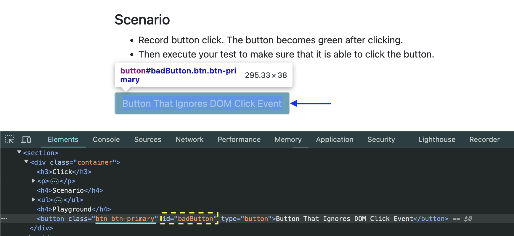
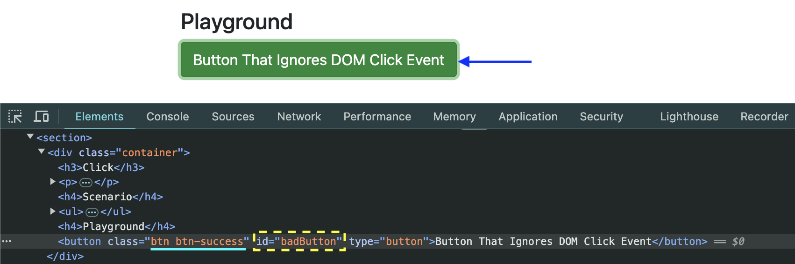

# Lecture 009 - NPM & Package.json

1. review node is installed
2. check it out node version

```javascript
$ node -v
```

3. check it out npm version

```javascript
$ npm -v
```

4. Create a working folder then run the following command:

```javascript
$ npm init
```

5. complete all steps

- package name: (cypress-course) `cypress-course`
- version: (1.0.0)
- description:`Cypress automation Project from Udemy`
- entry point: (index.js)
- test command: `cypress open`
- git repository:
- keywords: `cypress` `javascript` `typescript` `testing`
- author: `Luiggie`
- license: (ISC)

6. Result

```javascript
{
  "name": "cypress-course",
  "version": "1.0.0",
  "description": "Cypress automation Project from Udemy",
  "main": "index.js",
  "scripts": {
    "test": "cypress open"
  },
  "keywords": [
    "cypress",
    "javascript",
    "typescript",
    "testing"
  ],
  "author": "Luiggie",
  "license": "ISC",
  "devDependencies": {}
}
```

# Lecture 010 - Install Typescript

1. Run the following command in order to install Typescript

```javascript
$ npm install --save-dev typescript
```

2. Result: Typescript installed

```javascript
{
...
  "devDependencies": {
    "typescript": "^5.7.3"
  }
}
```

# Lecture 011 - Install Cypress

1. execute this command in order to install cypress

```javascript
$ npm install cypress --save-dev
```

2. Result:

```javascript
    "devDependencies": {
        "cypress": "^14.0.2",
        "typescript": "^5.7.3"
    }
```

3. In case any project does not have `node_modules`, run:

```javascript
$ npm i
```

or

```js
$ npm install
```


4. In case of corruption file, execute:
```js
$ npx cypress install
```

# Lecture 012 - Configuring Cypress for E2E Testing

1. Open `package.json` file then modify the `"test": "cypress open"` line:

for this script:

```javascript
  "scripts": {
    "test": "cypress open"
  },
```

execute from the terminal:

```js
$ npm run test
```

or

for the following scripts section in package.json file:

```javascript
  "scripts": {
    "runner": "cypress open"
  },
```

execute from the terminal:

```js
$ npm run runner
```

# Lecture 013 - First Hello World

1. First structure:

```javascript
cypress
 ├-- downloads
 └-- e2e
   ├-- helloworld.cy.ts
   └-- ...
```

2. `helloworld.cy.ts` file content:

```javascript
describe("template spec", () => {
  it("passes", () => {
    //cy.visit("https://example.cypress.io");

    //Print a message to the Cypress Command Log
    cy.log("Hello World");
  });
});
```

# Lecture 014 - Testing Javascript using Typescript + Cypress

1. Duplicate the `helloworld.cy.ts` then change its extension to `.js`

```javascript
cypress
 ├-- downloads
 └-- e2e
   ├-- helloworld.cy.ts
   ├-- helloworld.cy.js
   └-- ...
```

# Lecture 015 - Test Runner - E2E time saving tip

1. Open `package.json` file then modify `"script"` section content:

```javascript
  "scripts": {
    "runner": "cypress open --e2e --browser chrome",
    "test": "cypress open"
  },
```

2. `--e2e` flag runner goes to e2e directly
3. `--browser chrome` flag will open a chrome browser as default.
4. run from terminal:

```js
$ npm run runner
```

5. Or either one of the following commands per browser:

```js
$ npx cypress open --e2e --browser chrome
```

or

```js
$ npx cypress open --e2e --browser firefox
```

or

```js
$ npx cypress open --e2e --browser edge
```

# Lecture 017 - `describe` and `it`

1. `describe` means describe a specification or test-case with the given `title` and `callback` function acting as a `thunk`.
2. `describe` is like a test `suite`

```javascript
describe("empty spec", () => {
  it("test case #01", () => {
    cy.log("Hello World - Test Case #01");
  });

  it("test case #02", () => {
    cy.log("Hello World - Test Case #02");
  });

  it("test case #03", () => {
    cy.log("Hello World - Test Case #03");
  });
  ...
});
```

# Lecture 018 - Hooks: `before` and `after`

1. `before` and `after` hooks are executed once.
2. `before` hook starts the first
3. `after` hook executes the last
4. Between `before` and `after` hooks, each `it` test case is executed.

```javascript
describe("empty spec", () => {
  before(() => {
    cy.log("Hello from Before hook");
  });

  after(() => {
    cy.log("Hello from After hook");
  });

  it("test case #01", () => {
    cy.log("Hello World - Test Case #01");
  });

  it("test case #02", () => {
    cy.log("Hello World - Test Case #02");
  });

  it("test case #03", () => {
    cy.log("Hello World - Test Case #03");
  });
  ...
});
```

5. Expected execution result:
   

# Lecture 019 - Hooks: `beforeEach` and `afterEach`

1. `beforeEach` will be executed right before each test case or `it()`, but the first `beforeEach` hook will be executed right after the `before` hook.
2. `afterEach` will be executed right after each test case or `it()` however last afterEach will be executed right before the `after` hook.
3. Cypress test case code:

```javascript
describe("empty spec", () => {
  // before & after Hooks
  before(() => {
    cy.log("Hello from Before hook");
  });

  after(() => {
    cy.log("Hello from After hook");
  });

  // beforeEach & afterEach hooks:
  beforeEach(() => {
    cy.log("Hello from Before Each hook");
  });

  afterEach(() => {
    cy.log("Hello from After Each hook");
  });

  // each test case for "it"
  it("test case #01", () => {
    cy.log("Hello World - Test Case #01");
  });

  it("test case #02", () => {
    cy.log("Hello World - Test Case #02");
  });
});
```

4. Expected execution result:
   

# Lecture 020 - `skip` and `only`

1. When you have many test case and you want to execute a specific test case, you should add `.only` rto the chosen `it`.

```js
describe("empty spec", () => {
  it("test case #01", () => {
    cy.log("Hello World - Test Case #01");
  });

  it.only("test case #02", () => {
    cy.log("Hello World - Test Case #02");
  });

  it("test case #02", () => {
    cy.log("Hello World - Test Case #02");
  });
});
```

In previous code, test case #02 will be executed only, due to `it.only`.

2. In opposite case, when you don't want to execute a specific test case, you should add `.skip` to the chosen `it`.

```js
describe("empty spec", () => {
  it("test case #01", () => {
    cy.log("Hello World - Test Case #01");
  });

  it("test case #02", () => {
    cy.log("Hello World - Test Case #02");
  });

  it.skip("test case #02", () => {
    cy.log("Hello World - Test Case #03");
  });
});
```

In above code, `test case #01` and `test case #02` will be executed, and `test case #03` will be skipped.

# lecture 021 - Variables: Differences between Javascript and Typescript

```js
it("Typescript introduction - data types", () => {
  /* Complains:
    let stringVariable: string = true;
    let stringVariable: string = false;
    let stringVariable: string = -9;
    let stringVariable: string = 0;
  */
  let stringVariable: string = "9";

  /* complains:
    let numberVariable: number = '8';
    let numberVariable: number = true;
    let numberVariable: number = false;
  */
  let numberVariable: number = 9;

  /* complains:
    let booleanVariable: boolean = '14'
    let booleanVariable: boolean = 'hello'
    let booleanVariable: boolean = 9
    let booleanVariable: boolean = -12.867
    let booleanVariable: boolean = 'true'
    let booleanVariable: boolean = 'false'
  */
  let booleanVariable1: boolean = true;
  let booleanVariable2: boolean = false;
});
```

# Lecture 022 - Functions: Differences between Javascript and Typescript

```js
it("Typescript - Functions", () => {
  /* Functions:
    num01: number => num01 is a number type.
    num02: number => mun02 is a number type.

    function addTwoNumber(...): number{...}
    => that means this function returns a number type.
  */
  function addTwoNumbers(num01: number, num02: number): number {
    return a + b;
  }
});
```

# Lecture 023 - Interface: Use Case

```js
interface Persona {
  username: string;
  lastname: string;
  age: number;
}

function returnUserInfo(user: Persona): void {
  console.log(`This is the username: ${user.username}`);
  console.log(`This is the lastname: ${user.lastname}`);
  console.log(`This is the age: ${user.age}`);
}
```

1. defining `Person` interface.
2. `returnUserInfo`function does not return any value so you must add `: void`.

# Lecture 024 - More about Typescript

Link: [Typescript documentation](https://www.typescriptlang.org/docs/)

# Lecture 025 - Visit website using Cypress

> Link: [UI Test Automation Playground](http://uitestingplayground.com/textinput)

1. In order to open a specific webpage, use following code:

```js
cy.visit(URL);
```

2. As you can see the whole code:

```js
describe("Basics", () => {
  it("Visit explanation", () => {
    cy.visit("http://uitestingplayground.com/textinput");
  });
});
```

# Lecture 026 - Base URL: A must concept

1. Open either `cypress.config.ts` or `cypress.config.js`
2. Add `baseUrl` value inside `e2e` section:

```js
baseUrl: "http://uitestingplayground.com";
```

3. completed code inside either `cypress.config.ts` or `cypress.config.js` file must be as follow:

```js
import { defineConfig } from 'cypress';

export default defineConfig({
    e2e: {
        //baseUrl: URL_link;
        baseUrl: "http://uitestingplayground.com";
        setupNodeevents(on, config) {
            // implement node event listeners here
        },
    }
})
```

4. Go to test case and add _path_ only inside `cy.visit()`

```
cypress
 ├-- downloads
 └-- e2e
   ├-- test_case_name.cy.ts
   ├-- test_case_name.cy.js
   └-- ...
```

It should as:

```js
describe("Basics", () => {
  it("Visit explanation text input", () => {
    cy.visit("/textinput");
  });
});
```

or

```js
describe("Basics", () => {
  it("Visit explanation text input", () => {
    cy.visit("/classattr");
  });
});
```

5. In case you want to add the baseUrl from terminal, add the following `--config baseurl=URL_link` flag in script section from `package.json` file:

```js
"script": {
    "runner": "cypress open --e2e --browser edge --config baseurl=URL_link"
}
```

Given a URL_link:

```bash
$ npx cypress open --e2e --browser edge --config baseUrl=URL_link
```

# Lecture 027 - `cy.visit()` with hooks:

Having

```js
import { defineConfig } from 'cypress';

export default defineConfig({
    e2e: {
        //baseUrl: URL_link;
        baseUrl: "http://uitestingplayground.com";
        setupNodeevents(on, config) {
            // implement node event listeners here
        },
    }
})
```

1. Issue:

```js
describe("Basics", () => {
  it("Visit explanation", () => {
    cy.visit("/textinput");
  });

  it("Visit explanation", () => {
    cy.visit("/textinput");
  });

  it("Visit explanation", () => {
    cy.visit("/textinput");
  });
});
```

2. Fix:

```js
describe("Basics", () => {
  beforeEach(() => {
    cy.visit("/textinput");
  });

  it("Visit explanation", () => {
    cy.log("Test Case #01");
  });

  it("Visit explanation", () => {
    cy.log("Test Case #02");
  });

  it("Visit explanation", () => {
    cy.log("Test Case #03");
  });
});
```

# Lecture 028 - Subject Management in Cypress:

```js
it("visit explanation text input", () => {
  cy.url().then((url) => {
    cy.log(`Printing the URL: ${url}`);
  });
});
```

# Lecture 029 - `cy.url` and BDD assertion

[Assertions in Cypress](https://docs.cypress.io/app/references/assertions)

| chainer        |                             assertions                             |
| -------------- | :----------------------------------------------------------------: |
| constain(text) | `.should('contain', 'text');`<br> `expect($el).to.contain('text')` |

|

```js
describe("", () => {
  beforeEach(() => {
    cy.visit("http://uitestingplayground.com/textinput");
  });

  it("visit explanation text input", () => {
    cy.url().then((url) => {
      cy.log(`Printing the URL ${url}`);
      expect(url).to.contains("/textinput");
    });
  });
});
```

## Core Assertions (Chai, used within Cypress):

### 1. `should` (Chaining for Readability): This remains your workhorse, but we'll structure it for BDD flow.

- > Presence/Visibility:

```js
cy.get("#myElement").should("be.visible"); // Element is visible
cy.get("#myElement").should("exist"); // Element exists in DOM
cy.get("#myElement").should("not.exist"); // Element does NOT exist
```

- > Content:

```js
cy.get("#myElement").should("have.text", "Expected Text"); // Exact match
cy.get("#myElement").should("contain", "Partial Text"); // Partial match
cy.get("#myElement").should("not.contain", "Unexpected Text"); // Negative match
cy.get("#myInput").should("have.value", "Expected Value"); // Input value
```

- > State:

```js
cy.get("#myCheckbox").should("be.checked"); // Checkbox is checked
cy.get("#myCheckbox").should("not.be.checked"); // Checkbox is NOT checked
cy.get("#myButton").should("be.enabled"); // Button is enabled
cy.get("#myButton").should("be.disabled"); // Button is disabled
cy.get("#myElement").should("have.class", "active"); // Has specific class
```

- > Attributes:

```js
cy.get("#myImage").should("have.attr", "src", "/path/to/image.jpg");
cy.get("#myLink").should("have.attr", "href", "https://example.com");
```

- > CSS:

```js
cy.get("#myElement").should("have.css", "background-color", "rgb(255, 0, 0)"); // Check computed CSS
cy.get("#myElement").should("have.css", "width", "100px");
```

- > Length/Count:

```js
cy.get(".listItem").should("have.length", 5); // Number of elements
cy.get(".listItem").should("have.length.greaterThan", 0); // At least one element
```

- > Chaining (BDD Style): Combine for a more descriptive assertion:

```js
cy.get("#myElement")
  .should("be.visible")
  .and("contain", "Expected Text")
  .and("have.class", "active");
```

### 2. `expect` (Explicit BDD): Provides more flexibility for complex scenarios.

- > Basic `expect`:

```js
cy.get("#myElement").then(($el) => {
  expect($el.text()).to.equal("Expected Text");
  expect($el.val()).to.equal("Expected Value"); // For input fields
});
```

- > Chai Assertions within `expect`: Leverage Chai's full power:

```js
cy.get("#myElement").then(($el) => {
  expect($el).to.be.visible;
  expect($el).to.have.class("active");
  expect($el.attr("href")).to.contain("example.com");
  expect($el.text()).to.match(/regex/); // Regular expression match
});
```

- > Arrays/Objects (Important for APIs):

```js
cy.request("/api/users").then((response) => {
  expect(response.status).to.eq(200);
  expect(response.body).to.be.an("array").that.has.lengthOf(2);
  expect(response.body[0]).to.have.property("name", "John Doe");
});
```

### 3. Examplewith BDD focus:

- > Scenario - user login:

```js
it("should allow user to login", () => {
  cy.visit("/login");

  cy.get("#username").type("myuser");
  cy.get("#password").type("mypassword");
  cy.get("#login-button").click();

  cy.url().should("include", "/dashboard"); // Assert navigation
  cy.get("#welcome-message")
    .should("be.visible")
    .and("contain", "Welcome, myuser!"); // Assert welcome message
  cy.get("#logout-button").should("be.visible"); // Assert logout button is now visible
});
```

- > Scenario - API Response Validation

```js
it("should return a list of products", () => {
  cy.request("/api/products").then((response) => {
    expect(response.status).to.eq(200);
    expect(response.body).to.be.an("array");
    expect(response.body).to.have.length.greaterThan(0);

    response.body.forEach((product) => {
      expect(product).to.have.property("id");
      expect(product).to.have.property("name");
      expect(product).to.have.property("price");
    });
  });
});
```

# Lecture 030 - `cy.title()` and its validation

since having this html code:

```html
<head>
  <meta charset="utf-8" />
  ...
  <title>Text Input</title>
  ...
</head>
```

Ideal way to get the title in `<title>Text Input</title>` is using `cy.title()`

```js
cy.title().then((title) => {
  // Printing title:
  cy.log(`URL title is: ${title}`);

  //Validating title value:
  expect(title).to.be.equal("Text Input");
});
```

# lecture 031 - Challenge:

1. Important links to visit and read:

- [.get()](https://docs.cypress.io/api/commands/get#__docusaurus_skipToContent_fallback)

```js
cy.get("locator/selector");
```

- [.type()](https://docs.cypress.io/api/commands/type#__docusaurus_skipToContent_fallback)

```js
cy.get("locator").type("any text");
```

-[.should()](https://docs.cypress.io/api/commands/should#__docusaurus_skipToContent_fallback)

```js
cy.get("locator").should("...", "...");
```

2. Some topics to consider betweem `.should()` and `.then()`:
   > .should() and .then() are equals when there's some validation/assessment/expect:

```js
it("using .then()", () => {
  cy.url().then((url) => {
    expect(url).to.contains("/textinput");
  });
});
```

or

```js
it("using .should()", () => {
  cy.url().should((url) => {
    expect(url).to.contains("/textinput");
  });
});
```

> When there's some cy.log or other operation but expect/validaction, `.should()` will be failed:

```js
it("using .then()", () => {
  cy.url().then((url) => {
    cy.log(`URL is ${url}`);
    expect(url).to.contains("/textinput");
  });
});
```

or

```js
it("using .then()", () => {
  cy.url().should((url) => {
    cy.log(`URL is ${url}`); // 👈🏽  ❌
    expect(url).to.contains("/textinput");
  });
});
```

# Lecture 039 - `cy.contains()`:

Since button id is dynamic, search the button by contained text.

```js
describe("Dynamic Id", () => {
  beforeEach(() => {
    cy.visit("http://uitestingplayground.com/dynamicid");
  });

  it("cy.contains()", () => {
    cy.log("Button with Dynamic ID");
    cy.contains("Button with Dynamic ID").should(
      "have.text",
      "Button with Dynamic ID"
    );
  });
});
```

# Lecture 040 - `cy.find()` or `.find()`:

```js
describe(".find() ", () => {
  it("cy.get() + cy.find()", () => {
    cy.visit("http://uitestingplayground.com/dynamicid");
    cy.log("Button with Dynamic ID");
    cy.get("div").find("button").should("have.text", "Button with Dynamic ID");
  });
});
```

# Lecture 041 - attribute locator - CSS Selectors

Since it shows the following element:

```html
<button class="btn btn-primary" type="button" id="Dynamic_Id">
  Button with Dynamic ID
</button>
```

in order to get the selector by CSS selector:

```js
cy.get('button[class="btn btn-primary"]').click();
```

and its test should be as:

```js
it("CSS Selector", () => {
  cy.visit("http://uitestingplayground.com/dynamicid");
  cy.log("Button with Dynamic ID");
  cy.get("button[class='btn btn-primary']").should(
    "have.text",
    "Button with Dynamic ID"
  );
});
```

# Lecture 044 - Xpath Overview

[Xpath cheatsheet](https://devhints.io/xpath)

# Lecture 045 - How to install Xpath Dependency?

1. In your terminal run the command: `$ npm i @cypress/xpath`
2. In your framework support file [cypress/support/e2e.{js/ts}] add at the top of the file the next line: `require('@cypress/xpath')`
3. You can continue with the next lecture

## Lecture 046 - Text locator - XPath Locator

`//*[text()="Correct variant is"]`

- `//` start with xpath (xml path)
- where `*` means any tag.
- `[text()=="...."]`

my code:

```js
it("Class Locator - CSS selector", () => {
  cy.visit("http://uitestingplayground.com/classattr");
  cy.xpath('//*[text()="Correct variant is"]').should(
    "contain.text",
    "Correct"
  );
});
```

# Lecture 047 - attribute locator - Xpath locator

Given the following HTML codes:

```html
<pre class=" language-bash">
  <code class=" language-bash">//button[@class='btn-primary']</code>
</pre>
```

and

```html
<button class="btn class1 btn-warning btn-test" type="button">Button</button>
```

used in Cypress test case:

```js
it("Find an element by its attribute using xpath", () => {
  cy.visit("http://uitestingplayground.com/classattr");
  cy.xpath(`//code[@class=" language-bash"]`).should(
    "contain.text",
    "normalize-space"
  );
  cy.wait(1500);
  cy.xpath(`//button[@class="btn class1 btn-primary btn-test"]`).should(
    "contain.text",
    "Button"
  );
});
```

# Lecture 050 - CSS Property (Background Color - RGB code only)

```html
<button class="btn class2 btn-warning btn-test" type="button">Button</button>
```

```css
background-color: #ffc107;
```

```js
cy.xpath(`//button[contains(concat('', @class, ''), ' btn-warning ')]`).should(
  "have.css",
  "background-color",
  "rgb(255, 193, 7)"
);
```

# Lecture 054 - Element loading times with example

Important adding this command:

```js
Cypress.config("defaultCommandTimeout", MAX_TIMEOUT_MS);
```

then you see the pseudo-fix:

```js
Cypress.config("defaultCommandTimeout", 16000);

describe("defaultCommandTimeout", () => {
  it("Retry ability demo - visit with delay", () => {
    cy.visit("http://uitestingplayground.com/clientdelay");
    cy.get("#ajaxButton").click();
    //cy.wait(2000);

    cy.get(".bg-success")
      .should("be.visible")
      .and("have.text", "Data calculated on the client side.");
  });
});
```

# Lecture 056 - Best Practices Review

> [`.then()` and `.should()`](https://docs.cypress.io/api/commands/should#Whats-the-difference-between-then-and-shouldand)

> [Timeouts](https://docs.cypress.io/app/references/configuration#Timeouts)

Add in the test case `AMOUNT_NEEDED`:

```js
Cypress.config("defaultCommandTimeout", AMOUNT_NEEDED);
```

# Lecture 057 - Click - Class and Background Validation

> Before clicking on button:

```html
<button class="btn btn-primary" id="badButton" type="button">
  Button That Ignores DOM Click Event
</button>
```



> After clicking on button:

```html
<button class="btn btn-success" id="badButton" type="button">
  Button That Ignores DOM Click Event
</button>
```



> Cypress test cases:

```js
describe("Click challenge", () => {
  beforeEach(() => {
    cy.visit("http://uitestingplayground.com/click");
  });
  it("Checking Class Assertion", () => {
    cy.get("#badButton").click().should("have.class", "btn-success");
    cy.wait(1500);
  });

  it("Checking Class Assertion", () => {
    cy.get("#badButton")
      .click()
      .should("have.css", "background-color", "rgb(40, 167, 69)");
  });
});
```

# Lecture 058 - Hovering a button

> install a hover plugin: [Hover plugin](https://github.com/dmtrKovalenko/cypress-real-events?tab=readme-ov-file#installation)

```js
$ npm install -D cypress-real-events
```

(-D: dev dependencies)

In `package.json` file `"cypress-real-events"` will be added:

```js
"devDependencies": {
  "cypress": "^14.0.2",
  "cypress-real-events": "^1.14.0",
  "typescript": "^5.7.3"
},
```

Open `tsconfig.json` file then add in `"types"` section `"cypress-real-events"`:

```js
{
  "compilerOptions": {
    "target": "es5",
    "lib": ["es5", "dom"],
    "types": ["cypress", "node", "cypress-xpath", "cypress-real-events"]
  },
  "include": ["**/*.ts", "e2e/02-helloworld.cy.js"]
}
```

# Lecture 060: Environment Variables: Setup and CLI example

1. Inside `cypress.config.ts` add:

```js
import { defineConfig } from "cypress";

export default defineConfig({
  e2e: {
    baseUrl: "",
    setupNodeEvents(on, config) {
      // implement node event listeners here
    },
    env: {
      demoVar: "Hello from Cypress Environment Variable", // <==== added
    },
  },
  pageLoadTimeout: 60000,
});
```

2. From CLI, open `package.json` file and add a new script:

```json
  "scripts": {
    "runner": "cypress open --e2e --browser firefox",
    "test": "cypress open",
    "newEnvCli": "cypress open --e2e --browser firefox --env demoVar=Hello_from_package_file_json"
  },
```

then run:

```bash
$ npm run newEnvCli
```

In test case:

```js
describe("Environment Variable Demo", () => {
  it("Demo", () => {
    cy.log(`Printint Environment Variable Value: "${Cypress.env("demoVar")}"`);
  });
});
```

# Lecture 063: Bypass Exceptions:

1. Create the support/`exceptions.ts` file as follow:

```
cypress
├── download/...
├── e2e/...
├── fixtures/...
├── support
│   └── commands.ts
│   └── e2e.ts
│   └── exceptions.ts   (*)
└── node_modules/...
```

2. Inside `exception.ts` file add:

```js
Cypress.on("uncaught:exception", (err, runnable) => {
  return false;
});
```

3. Import `exceptions.ts` file in `e2e.ts` file:

```js
import "./commands";
import "./exceptions"; (*)
require("@cypress/xpath");
```

# Lecture 064: Viewport Configuration

1. Viewport settings from `cypress.config.ts` file:

```js
export default defineConfig({
  e2e: {
    // baseUrl: "",
    setupNodeEvents(on, config) {
      // implement node event listeners here
    },
    //...
  },
  pageLoadTimeout: 60000,
  viewportHeight:972, (*)
  viewportWidth: 1512, (*)
});
```

2. From test case using `cy.viewport()` command:

```js
//by default ==> from `cypress.config.ts` file
it(`Visit ${Cypress.env("nucba")}`, () => {
  cy.visit(`${Cypress.env("nucba")}`);
  cy.wait(2000);
});

it(`Visit ${Cypress.env("ladrones")}`, () => {
  cy.viewport("iphone-x");
  cy.visit(`${Cypress.env("ladrones")}`);
  cy.wait(2000);
});

it(`Visit ${Cypress.env("sauceLabs")}`, () => {
  cy.viewport("ipad-mini");
  cy.visit(`${Cypress.env("sauceLabs")}`);
  cy.wait(2000);
});

it(`Visit ${Cypress.env("demoQA")}`, () => {
  cy.viewport(800, 800);
  cy.visit(`${Cypress.env("demoQA")}`);
  cy.wait(2000);
});
```

```


```
```


```

# Lecture - Different environments:

1. [Control Center - sit env](https://controlcenter-sit.prlb.online/)
2. [Control Center - qe env](https://controlcenter-qe.prlb.online/)
3. [Control Center - staging env](https://controlcenter-staging.prlb.online/)

```js
https://controlcenter-sit.prlb.online/
https://controlcenter-qe.prlb.online/
https://controlcenter-staging.prlb.online/
```
